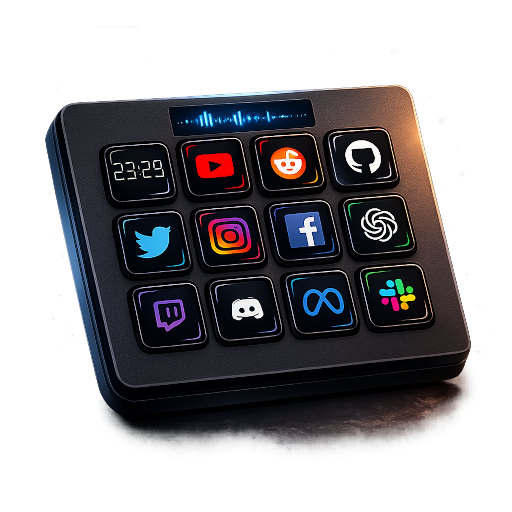
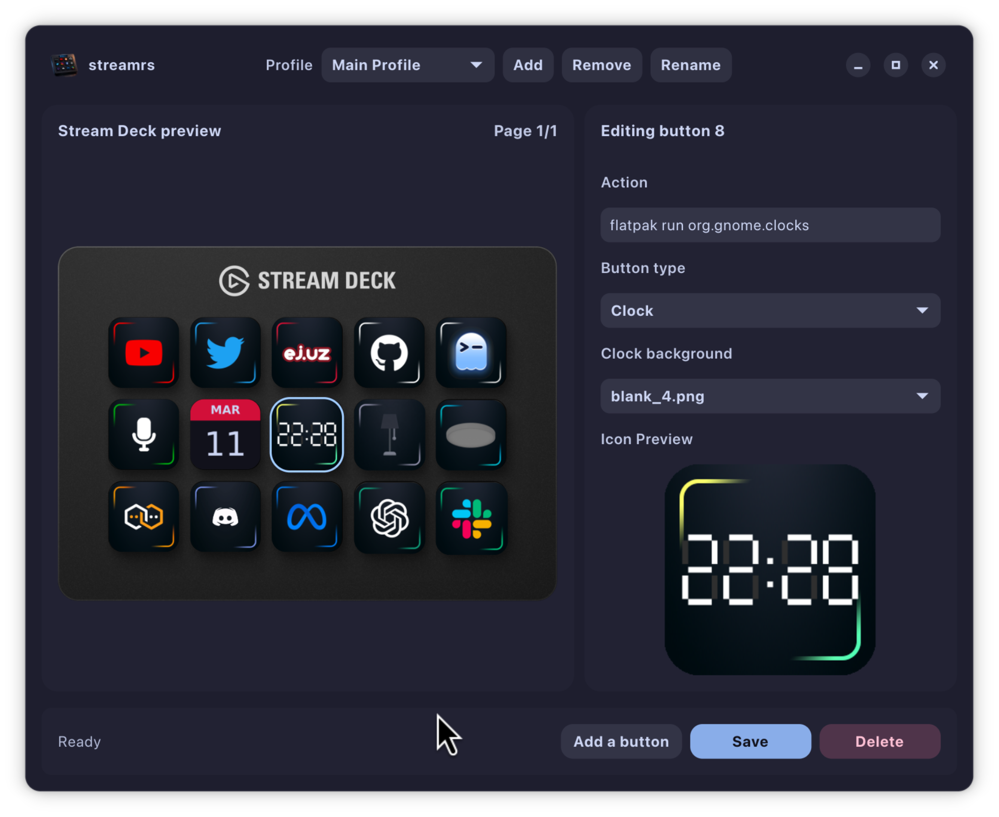

<!-- LOGO -->
<h1 align="center">
  
  <br>streamrs
</h1>

<p align="center">
  A lightweight Rust Stream Deck toolkit for Linux.
  <br />
  <a href="#about">About</a>
  ·
  <a href="#download">Download</a>
  ·
  <a href="#documentation">Documentation</a>
  ·
  <a href="development.md">Developing</a>
</p>

<p align="center">
  
</p>

## About

`streamrs` is a lightweight Stream Deck toolkit focused on a simple Linux-first workflow for configuring keys, icons, and actions on Stream Deck hardware.

It is built for and tested on:
- Elgato Stream Deck MK.2
- USB ID `0fd9:0080`

Feature highlights:
- Static icons: PNG, JPEG/JPG, SVG
- Animated icons: GIF, APNG, animated WebP
- Built-in clock icon (`clock.svg`)
- Status-driven toggle icons via polling commands
- Automatic pagination when config has more than 15 keys

## Download

Install a release `.deb` (recommended on Debian/Ubuntu):

Release files are published on the GitHub Releases page:
- https://github.com/EriksRemess/streamrs/releases

```bash
sudo apt install ./streamrs_<version>_amd64.deb
```

Quick start after install:
1. Plug in the Stream Deck
2. Open the GUI: `streamrs-gui`
3. Edit buttons and save

Service behavior:
- On install, `streamrs.service` is enabled and started for active logged-in regular users
- On package upgrade, the service is restarted for active logged-in regular users
- To enable it for an additional user later, log into that user and run:

```bash
systemctl --user enable --now streamrs.service
```

- On each service start/restart, `streamrs --init --force-images` runs first:
  - creates a config if missing
  - refreshes bundled images from the package
  - keeps your existing config unless you explicitly run `streamrs --init --force`

## Documentation

### Running and Service Management

Open the GUI configurator:

```bash
streamrs-gui
```

Manually start the daemon (if you do not want to use the service):

```bash
streamrs
```

Useful service commands:

```bash
systemctl --user status streamrs.service
systemctl --user restart streamrs.service
systemctl --user stop streamrs.service
```

### Profiles and File Locations

Default profile files live in:
- Config: `~/.config/streamrs/default.toml`
- Images: `~/.local/share/streamrs/default/`

Additional profiles use:
- `~/.config/streamrs/<name>.toml`
- `~/.local/share/streamrs/<name>/`

Notes:
- If the config is missing, `streamrs` auto-initializes the profile from bundled defaults
- `streamrs --init --force` refreshes config and bundled images from package defaults

### CLI Basics

Common `streamrs` flags:
- `--profile <name>`: use another profile
- `--config <path>`: use a custom config file
- `--debug`: inherit child process stdout/stderr
- `--init`: initialize profile files and exit
- `--force`: with `--init`, overwrite existing config/images

### Preview Renderer

Generate a mock image from your current profile:

```bash
streamrs-preview --output mock.png
```

Notes:
- If `--output` is omitted, it writes `mock.png`
- It reads your profile config/images first, then falls back to packaged defaults if needed

### Icon Composer

Create a Stream Deck icon from a logo (`.svg` or `.png`):

```bash
streamrs-icon-compose path/to/logo.svg
```

Defaults:
- Output directory: `~/.local/share/streamrs/default/`
- Output name: `<logo>-icon.png` (auto-suffixed if needed)

Options:
- `--output <path>`
- `--padding <ratio>` (0.0..0.5)

## Developing

Developer-focused setup, source builds, packaging, maintainer notes, and contribution guidance are in [development.md](development.md).

## Credits

- Icon pack source: https://marketplace.elgato.com/product/hexaza-3d4ed1dc-bf33-4f30-9ecd-201769f10c0d
