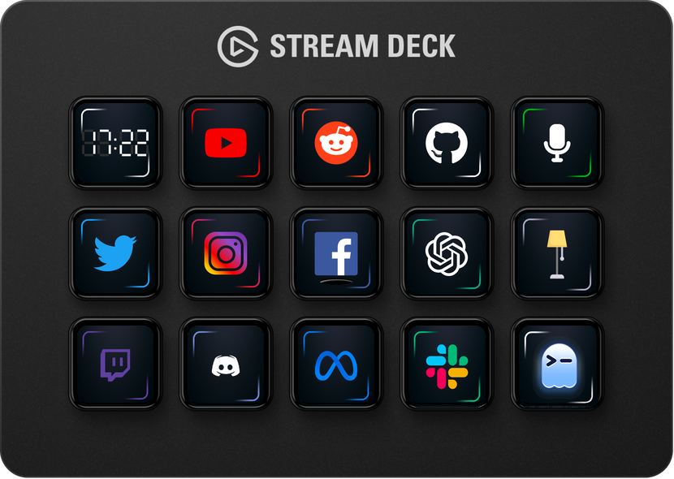

# streamrs

A lightweight Rust daemon for Stream Deck that maps keys to icons and shell commands.

## Hardware

`streamrs` is built for and tested on:
- Elgato Stream Deck MK.2
- USB ID: `0fd9:0080`
- `vendor_id = 4057` (`0x0fd9`)
- `product_id = 128` (`0x0080`)

## Features

- Supports static icons: PNG, JPEG/JPG, SVG
- Supports animated icons: GIF, APNG, animated WebP (rendered by streamrs frame-by-frame)
- Built-in digital clock icon via `icon = "clock.svg"` (or `icon = "clock://hh:mm"`)
- Optional key actions: missing or blank `action` means no-op on press
- Status-driven toggle icons via polling commands
- Automatic pagination when config has more than 15 keys
- Auto-initializes profile assets when config is missing

Clock details:
- Renders `HH:MM` once per second
- Uses `blank.png` as background when present
- Falls back to an internal dark background when `blank.png` is missing

Status icon fields:
- `status = "<command>"`: executed with `sh -c`; exit code `0` = ON, non-zero = OFF
- `icon_on` / `icon_off`: optional ON/OFF icons (fallback to `icon` when omitted)
- `status_interval_ms`: optional poll interval in milliseconds

## Install

Install binary + assets + user systemd service:

```bash
make install
```

This installs:
- Binary: `~/.local/bin/streamrs`
- Config: `~/.config/streamrs/default.toml`
- Images: `~/.local/share/streamrs/default/`
- User service: `~/.config/systemd/user/streamrs.service`

The install target enables the service and starts it, or restarts it if already running.

## Usage

Run manually:

```bash
streamrs
```

CLI flags:
- `--debug`: inherit child process stdout/stderr
- `--profile <name>`: use `~/.config/streamrs/<name>.toml` and `~/.local/share/streamrs/<name>/`
- `--config <path>`: use a custom config path
- `--init`: initialize profile config + images, print service commands, then exit
- `--force`: with `--init`, overwrite existing config/images from source assets

Notes:
- If config is missing, streamrs auto-runs profile initialization before startup.
- `--force` overwrites known source files but does not remove extra files already in the profile image directory.

Pagination:
- `stream-deck-next-page.png` appears on bottom-right when a next page exists.
- `stream-deck-previous-page.png` appears in the bottom-right area when a previous page exists.

## Preview

Generate the mock image used at the top of this README:

```bash
make mock
```

Or run the preview binary directly:

```bash
streamrs-preview --output mock.png
```

Notes:
- `streamrs-preview` only supports `--output`.
- Default output is `mock.png` if `--output` is omitted.
- Preview rendering uses built-in defaults for template, config/image discovery, and size (`780x554`).

## Systemd

Manual service commands:

```bash
systemctl --user daemon-reload
systemctl --user enable --now streamrs.service
systemctl --user restart streamrs.service
```

## Debian Releases

- GitHub Actions builds `.deb` artifacts for CI.
- Pushing a tag like `vX.Y.Z` publishes a release `.deb` to GitHub Releases.

## Credits

- Icon pack source: https://marketplace.elgato.com/product/hexaza-3d4ed1dc-bf33-4f30-9ecd-201769f10c0d
